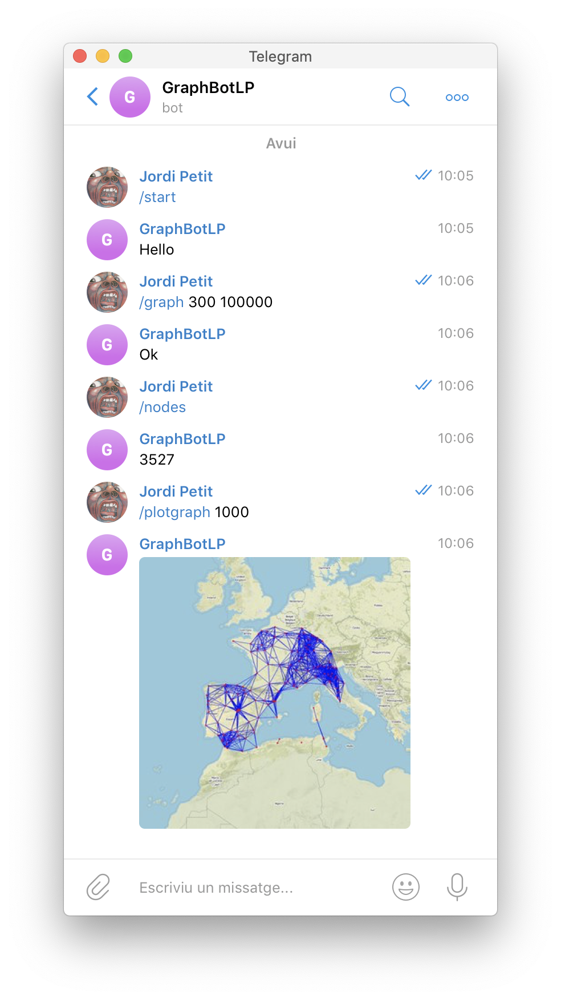
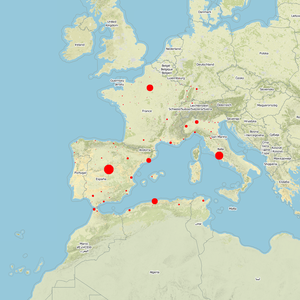
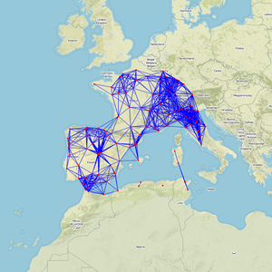
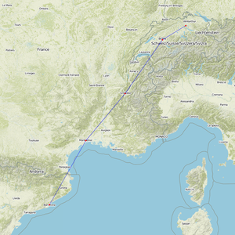

# GraphBot

El projecte GraphBot per GEI-LP (edició 2019).

## Introducció

Aquesta pàgina descriu el projecte GraphBot, que correspon a la pràctica de
Python pel curs de primavera 2019 de LP al GEI. La vostra tasca consisteix en
implementar un Bot de Telegram que constesti textualment i gràficament (amb
mapes) preguntes relacionades amb grafs geomètrics definits sobre uns tres
milions de poblacions de tota la Terra.

Aquí en teniu una petita demostració:

## Grafs geomètrics

Un conjunt de punts en un espai i una distància *d* defineixen un graf geomètric
que té com a vèrtexs els punts i, com arestes, aquells parells de punts que es
troben a distància `<= d`.

## Dades

Trobareu les dades amb les ciutats de la Terra al fitxer
[dades/worldcitiespop.csv.gz](dades/worldcitiespop.csv.gz).
Aquestes dades provenen de [MaxMind](https://www.maxmind.com/) i estan
subjectes en aquesta [llicència](dades/LICENSE.txt).

## Comandes del Bot

El vostre Bot ha d'entendre i contestar correctament les comandes següents:

- `/start`

    Inicia la conversa amb el Bot.

- `/help`

    El Bot ha de contestar amb una llista de totes les possibles comandes i una breu
    documentació sobre el seu propòsit i ús.

- `/author`

    El Bot ha d'escriure el nom complet de l'autor del projecte i seu
    correu electrònic oficial de la facultat.

- `/graph ⟨distance⟩ ⟨population⟩`

    Indica al bot que, a partir d'aquest moment, utilitzi un nou graf.

    Per fer-ho, cal que descarregui les dades de
    [https://github.com/jordi-petit/lp-graphbot-2019/blob/master/dades/worldcitiespop.csv.gz?raw=true](https://github.com/jordi-petit/lp-graphbot-2019/blob/master/dades/worldcitiespop.csv.gz?raw=true) i construeixi el
    graf geomètric amb distància `⟨distance⟩` (en quilòmetres) i restringint-se a
    poblacions amb `⟨population⟩` habitants o més (cal ignorar les poblacions sense
    informació sobre la seva població).

    **Nota:** Totes les comandes posterior usen el darrer graf generat amb aquesta
    comanda. Per defecte, cal començar amb un graf inicial amb distància 300 i població 100000.

- `/nodes`

    Escriu el nombre de nodes en el graf.

- `/edges`

    Escriu el nombre d'arestes en el graf.

- `/components`

    Escriu el nombre de components connexs en el graf.

- `/plotpop ⟨dist⟩ [⟨lat⟩ ⟨lon⟩]`

    Mostra una mapa amb totes les ciutats del graf a distància menor o igual que
    `⟨dist⟩` de `⟨lat⟩,⟨lon⟩`. Les coordenades són opcionals: si no es dónen, es
    refereixen a la posició de l'usuari (aquest l'ha enviar prèviament). El format
    de les coordenades és el mateix que al fitxer de dades. Cada ciutat es mostra
    amb un cercle, de radi proporcional a la seva població.

    Per exemple:

    

- `/plotgraph ⟨dist⟩ [⟨lat⟩ ⟨lon⟩]`

    Mostra una mapa amb totes les ciutats del graf
    a distància menor o igual que `⟨dist⟩` de `⟨lat⟩,⟨lon⟩`
    i les arestes que es connecten.
    Les coordenades són opcionals: si no es dónen, es refereixen a la posició
    de l'usuari.

    Per exemple:

    

- `/route ⟨src⟩ ⟨dst⟩`

    Mostra una mapa amb
    les arestes del camí més curt per anar entre dues ciutats
    `⟨src⟩` i `⟨dst⟩`.

    La sintàxi de les ciutats és `"Nom, codi_país"`.  En cas de múltiples
    ocurrències, trieu-ne una d'arbitrària. Podeu utilitzar la distància de
    Lavenstein per cercar de forma més robusta en presència d'errors ortogràfics.

    Per exemple, aquesta podria ser la
    sortida de `/route "Barcelona, es" "Zurich, ch"`:

    

Si ho voleu, podeu definir comandes addicionals que facin el
vostre projecte més ric i interessant a nivell tècnic i algorísmic.
Documenteu-les adequadament.

Tracteu els errors de manera raonable. En particular, el vostre programa no
s'hauria d'espatllar per peticions incorrectes dels usuaris.

## Arquitectura

És la vostra responsabilitat escollir l'arquitectura més adient pel
sistema, tenint en compte que les funcions de tractament de dades i les
funcions del Bot de Telegram han d'estar clarament diferenciades.

## Eficiència

Feu que la vostra aplicació sigui usable. En particular, haureu de crear el
graf geomètric eficientment (uns pocs segons com a molt).  L'algorisme
quadràtic obvi no és una solució vàlida. Per tant, us caldrà alguna estructura
de dades i/o un algorisme que heu d'implementar vosatres mateixos.

Igualment, segurament haureu d'introduir límits raonables per la distància
i/o la població (si són massa petits caldria crear un graf molt gran).

Tingueu en compte que heu de descarregar les dades remotament. Amb
connexions lentes això pot prendre una mica de temps. Tingueu també en compte
que la generació de mapes es fa remotament.  Amb una conexió lenta pot trigar
en generar-los. Telegram tampoc envia les imatges massa ràpid. No us en preocupeu.

## Llibreries

Utilitzeu les llibreries de Python següents:

- `networkx` per a manipular grafs.
- `haversine` per calcular distàncies entre coordenades.
- `FuzzyWuzzy` per calcular semblances entre textos.
- `staticmap` per pintar mapes.
- `requests` per baixar fitxers.
- `python-telegram-bot` per interactuar amb Telegram.

Podeu utilitzar lliurament altres llibreries estàndards de Python, però si no
són estàndards, heu de demanar permís als vostres professors (que segurament
no us el donaran).

## Fonts d'informació

Aquests enllaços us seran útils per fer el vostre projecte:

- [Lliçons de bots de Telegram](https://lliçons.jutge.org/python/telegram.html)

- [Lliçons de fitxers en Python](https://lliçons.jutge.org/python/fitxers-i-formats.html)

- [Tutorial de NetworkX](https://networkx.github.io/documentation/stable/tutorial.html)

## Lliurament

Heu de lliurar la vostra pràctica al Racó.
Només heu de lliurar un fitxer ZIP que, al descomprimir-se
generi uns fitxers `*.py`, un fitxer `requirements.txt` i un
fitxer `README.md`. Res més. Sense directoris.

Els vostres fitxers de codi en Python han de seguir
[les regles d'estíl PEP8](https://www.python.org/dev/peps/pep-0008/),
tot i que podeu oblidar les restriccions sobre la llargada màxima
de les línies. Podeu
utilitzar el paquet `pep8` o http://pep8online.com/ per assegurar-vos
que seguiu aquestes regles d'estíl.
L'ús de tabuladors en el codi queda
prohibit (zero directe).

El projecte ha de contenir un fitxer `README.md`
que el documenti. Vegeu, per exemple, https://gist.github.com/PurpleBooth/109311bb0361f32d87a2.

El projecte també ha de contenir un fitxer `requirements.txt`
amb les llibreries que utilitza el vostre projecte.
Vegeu, per exemple, https://pip.pypa.io/en/stable/user_guide/#requirements-files.

El termini de lliurament és el divendres 7 de juny a les 23:59.

## Consells

La part del bot de Telegram és divertida, però deixeu-la pel final.

Per evitar problemes de còpies,
no pengeu el vostre projecte en repositoris públics. Si us cal un repositori
GIT, useu [GITLAB FIB](https://gitlab.fib.upc.edu/users/sign_in).

